# 🎨 Sistema de Colores Personalizados para Estudiantes

## 📋 Resumen

Este sistema permite que cada estudiante personalice los colores de su panel (color primario y acento) y los vea aplicados automáticamente en toda la interfaz del dashboard.

## 🏗️ Arquitectura del Sistema

### 1. **Hook Global: `useThemeColors`**
```typescript
// hooks/useThemeColors.ts
export function useThemeColors(primaryColor?: string, accentColor?: string)
```

**Funcionalidad:**
- Sincroniza colores personalizados con variables CSS globales
- Aplica valores por defecto si no se proporcionan colores
- Actualiza `--color-primary` y `--color-accent` en `:root`

### 2. **Layout del Dashboard: `app/student-dashboard/layout.tsx`**
```typescript
// Carga colores del estudiante al iniciar sesión
const [studentColors, setStudentColors] = useState({
  primary_color?: string
  accent_color?: string
})

// Aplica colores usando el hook
useThemeColors(studentColors.primary_color, studentColors.accent_color)
```

**Funcionalidad:**
- Carga colores desde `/api/student/settings/colors`
- Aplica colores automáticamente al cargar el dashboard
- Maneja errores y usa colores por defecto si falla

### 3. **Variables CSS: `app/globals.css`**
```css
:root {
  /* Colores personalizados del estudiante */
  --color-primary: #0ea5e9;
  --color-accent: #22c55e;
}

/* Utilidades Tailwind personalizadas */
.bg-custom-primary { background-color: var(--color-primary); }
.text-custom-primary { color: var(--color-primary); }
.border-custom-primary { border-color: var(--color-primary); }
/* ... más utilidades */
```

## 🎯 Cómo Usar

### Para Desarrolladores

#### 1. **Usar en Componentes React:**
```tsx
import { useThemeColors } from '@/hooks/useThemeColors'

function MiComponente() {
  const [primaryColor, setPrimaryColor] = useState('#0ea5e9')
  const [accentColor, setAccentColor] = useState('#22c55e')
  
  // Aplicar colores automáticamente
  useThemeColors(primaryColor, accentColor)
  
  return <div>Mi componente con colores personalizados</div>
}
```

#### 2. **Usar Clases CSS Personalizadas:**
```tsx
// En lugar de:
<div className="bg-blue-500 text-green-500">

// Usar:
<div className="bg-custom-primary text-custom-accent">
```

#### 3. **Usar Variables CSS Directamente:**
```tsx
<div style={{ 
  backgroundColor: 'var(--color-primary)',
  color: 'var(--color-accent)'
}}>
  Contenido personalizado
</div>
```

### Para Estudiantes

#### 1. **Acceder a Configuración:**
- Ir a `/student-dashboard/settings`
- Pestaña "🎨 Personalización"

#### 2. **Cambiar Colores:**
- Usar color picker visual
- O escribir código HEX manualmente
- Ver vista previa en tiempo real

#### 3. **Guardar Cambios:**
- Botón "Guardar Cambios"
- Los colores se aplican inmediatamente
- Persisten entre sesiones

## 🔧 API Endpoints

### GET `/api/student/settings/colors`
```typescript
// Query: ?token=session_token
// Response:
{
  "success": true,
  "primary_color": "#0ea5e9",
  "accent_color": "#22c55e"
}
```

### PUT `/api/student/settings/colors`
```typescript
// Body:
{
  "token": "session_token",
  "primary_color": "#ff6b6b",
  "accent_color": "#4ecdc4"
}
// Response:
{
  "success": true
}
```

## 🎨 Clases CSS Disponibles

### Colores de Fondo
- `.bg-custom-primary` - Color primario
- `.bg-custom-accent` - Color acento

### Colores de Texto
- `.text-custom-primary` - Texto color primario
- `.text-custom-accent` - Texto color acento

### Bordes
- `.border-custom-primary` - Borde color primario
- `.border-custom-accent` - Borde color acento

### Estados Hover
- `.hover:bg-custom-primary:hover` - Fondo primario al hover
- `.hover:text-custom-accent:hover` - Texto acento al hover

### Gradientes
- `.from-custom-primary` - Gradiente desde primario
- `.to-custom-accent` - Gradiente hasta acento

### Sombras
- `.shadow-custom-primary` - Sombra color primario
- `.shadow-custom-accent` - Sombra color acento

## 🔄 Flujo de Aplicación

```mermaid
graph TD
    A[Estudiante inicia sesión] --> B[Layout carga colores desde API]
    B --> C[useThemeColors aplica colores]
    C --> D[Variables CSS se actualizan]
    D --> E[UI se actualiza automáticamente]
    
    F[Estudiante cambia colores] --> G[Vista previa en tiempo real]
    G --> H[Estudiante guarda cambios]
    H --> I[API actualiza base de datos]
    I --> J[Colores persisten en sesión]
```



## 🛠️ Implementación Técnica

### 1. **Carga Inicial:**
```typescript
useEffect(() => {
  const loadStudentColors = async () => {
    const token = localStorage.getItem('session_token')
    const response = await fetch(`/api/student/settings/colors?token=${token}`)
    const data = await response.json()
    if (data.success) {
      setStudentColors({
        primary_color: data.primary_color,
        accent_color: data.accent_color
      })
    }
  }
  loadStudentColors()
}, [user, loading])
```

### 2. **Aplicación de Colores:**
```typescript
useEffect(() => {
  const root = document.documentElement
  root.style.setProperty("--color-primary", primaryColor || "#0ea5e9")
  root.style.setProperty("--color-accent", accentColor || "#22c55e")
}, [primaryColor, accentColor])
```

### 3. **Actualización en Tiempo Real:**
```typescript
// En la página de configuración
useEffect(() => {
  const root = document.documentElement
  root.style.setProperty('--color-primary', primaryColor)
  root.style.setProperty('--color-accent', accentColor)
}, [primaryColor, accentColor])
```

## ✅ Verificación del Sistema

### 1. **Base de Datos:**
```sql
-- Verificar tabla de preferencias
SELECT * FROM student_preferences LIMIT 5;

-- Verificar columnas de verificación de email
SELECT email_verified, email_verification_token FROM system_users LIMIT 5;
```

### 2. **API Endpoints:**
```bash
# Probar carga de colores
curl "http://localhost:3000/api/student/settings/colors?token=YOUR_TOKEN"

# Probar actualización de colores
curl -X PUT "http://localhost:3000/api/student/settings/colors" \
  -H "Content-Type: application/json" \
  -d '{"token":"YOUR_TOKEN","primary_color":"#ff6b6b","accent_color":"#4ecdc4"}'
```

### 3. **Interfaz de Usuario:**
- ✅ Colores se cargan automáticamente al iniciar sesión
- ✅ Cambios en configuración se aplican en tiempo real
- ✅ Colores persisten entre recargas de página
- ✅ Colores se mantienen al cerrar y abrir sesión

### 4. **Consola del Navegador:**
```javascript
// Verificar variables CSS aplicadas
console.log(getComputedStyle(document.documentElement).getPropertyValue('--color-primary'))
console.log(getComputedStyle(document.documentElement).getPropertyValue('--color-accent'))
```

## 🚀 Beneficios

1. **Personalización Individual:** Cada estudiante ve su esquema de colores único
2. **Aplicación Automática:** No requiere recarga de página
3. **Persistencia:** Los colores se mantienen entre sesiones
4. **Flexibilidad:** Fácil de extender con nuevos colores
5. **Compatibilidad:** Funciona con Tailwind CSS y componentes Shadcn
6. **Rendimiento:** Aplicación eficiente usando variables CSS

## 🔮 Extensiones Futuras

- **Temas Predefinidos:** Conjuntos de colores preestablecidos
- **Modo Oscuro/Claro:** Alternancia automática según preferencias
- **Más Colores:** Añadir colores secundarios, de fondo, etc.
- **Animaciones:** Transiciones suaves entre cambios de color
- **Exportar/Importar:** Compartir esquemas de colores entre estudiantes

---

## 📝 Notas de Desarrollo

- Los colores se almacenan en la tabla `student_preferences`
- Se usan variables CSS para máxima compatibilidad
- El hook `useThemeColors` es reutilizable en cualquier componente
- Las clases CSS personalizadas siguen la convención de Tailwind
- El sistema es completamente responsivo y accesible


